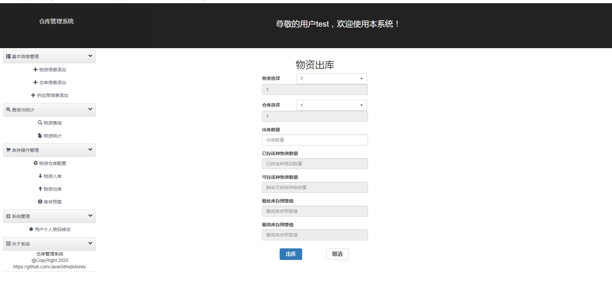

# 毕业设计仓库管理系统

> 可用于毕业设计参考或者个人学习用

- spring+srpingMVC+mybatic+mysql
- jsp

#### 实现功能
- [x] 超级管理员/普通管理员的登录与登出  
- [x] 物资仓库供应商的管理，  
- [x] 物资仓库配置/入库/出库 
- [x] 超级管理员/普通管理员的修改密码
- [x] 操作日志查询

#### 部分截图

# 源码完整版 可加qq：625285133 咨询获取，可一对一专业指定需求，个性化制定代码。
# 后续持续更新新系统，敬请期待！

